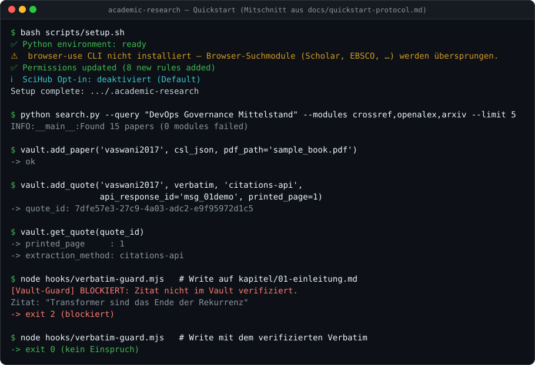
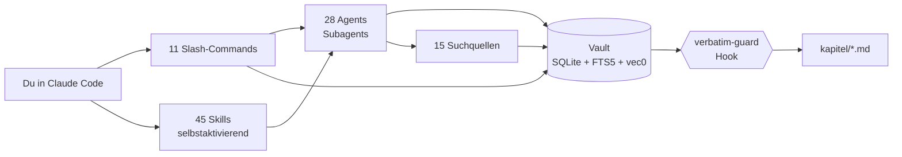

# Academic Research

[](https://github.com/ahlerjam/academic-research/actions/workflows/ci.yml)
[](https://codecov.io/gh/ahlerjam/academic-research)
[](CHANGELOG.md)
[](docs/reference/skills.md)
[](LICENSE)
[](https://code.claude.com/docs/en/plugins)

**Dein Forschungsassistent in Claude Code — von der Themenfindung bis zur Abgabe.**

Ein Claude-Code-Plugin für akademische Arbeiten: Facharbeit, Bachelor, Master, Diss.
Es durchsucht 15 wissenschaftliche Quellen parallel, bewertet Literatur in fünf
Dimensionen, schreibt Kapitelentwürfe mit seitengenauen Belegen und prüft Stil, Zitate
und Formalia — im Terminal, in normalem Deutsch.

**Für wen:** Studierende mit Bachelor-, Master- oder Hausarbeit · Doktorand\*innen mit
systematischem Review (PRISMA, Risk-of-Bias, Meta-Analyse) · Schüler\*innen mit
Facharbeit. Zitierstile, Formalia-Checks und der Anti-KI-Pass sind auf
deutschsprachige Hochschulen ausgelegt.

**Der Unterschied zum Chat-Fenster:** Zitate kommen aus einer Datenbank, nicht aus dem
Modellgedächtnis. Jedes Zitat liegt mit Quelle und Seitenzahl im Vault, und ein Hook
blockt jeden Kapitel-Write, dessen Zitat dort nicht steht.



<sub>Standbild des abgenommenen Durchlaufs aus
[docs/quickstart-protocol.md](docs/quickstart-protocol.md); Quelle ist der Mitschnitt
[docs/assets/quickstart.cast](docs/assets/quickstart.cast).</sub>

> [!WARNING]
> **Zitate trotzdem gegenprüfen.** Der `citation-extraction`-Skill liest PDFs lokal
> und prüft jeden Wortlaut serverseitig fail-closed gegen den PDF-Volltext
> (`local-verbatim`, kein eigener API-Key nötig) — trotzdem kann die Auswahl der
> Zitate danebenliegen. Prüfe jedes Zitat im Originaltext, bevor es in deine Arbeit
> wandert. Das gilt besonders für Seitenzahlen, Autorennamen und Erscheinungsjahre.
> Die Claude-Citations-API bleibt ein optionaler Alt-Pfad für Bestandszitate.

---

<!-- SCIHUB-DISCLAIMER-BLOCK: Nicht verschieben, nicht entfernen. G ergaenzt diesen Block in Welle 2 nur, aendert ihn nicht. -->
> [!CAUTION]
> **SciHub-Tier (F18) — Optionaler Last-Resort: Rechtlich umstritten, deine Verantwortung**
>
> Dieses Plugin kann optional SciHub als letzten Fallback nutzen, wenn alle anderen Quellen (Open Access,
> institutionelle Lizenzen, Fernleihe) keinen Zugang liefern.
>
> **SciHub ist per Default DEAKTIVIERT.** Aktivierung nur nach explizitem Opt-in beim Setup:
>
> ```
> /academic-research:setup
> # → Frage: "SciHub-Tier aktivieren? (Rechtlich umstritten — Nutzung auf deine eigene Verantwortung)"
> ```
>
> - SciHub operiert rechtlich in einer umstrittenen Zone — die Nutzung kann in deinem Land gegen das Urheberrecht verstossen.
> - Jeder via SciHub bezogene Volltext wird im Vault mit `provenance:scihub` getaggt.
> - Die rechtliche Aufklärung erfolgt **einmalig beim Opt-in** — nicht bei jedem einzelnen Fund.
>   Läuft der Tier, geschieht das anschließend ohne wiederholte Warnhinweise (Issue #459).
> - **Du trägst die alleinige rechtliche Verantwortung für die Nutzung des SciHub-Tiers.**
<!-- END SCIHUB-DISCLAIMER-BLOCK -->

---

## Was es kann

| | |
|---|---|
| **Suchen** | 15 Quellen parallel — 8 API-Quellen registriert (7 automatisch je Modus, `dblp` optional für Informatik-Themen via `--modules dblp`), 7 Browser-Module auf Wunsch. Dedupliziert, 5D-bewertet, geclustert. |
| **Belegen** | Vault-MCP-Server (SQLite + FTS5 + Vektor-Suche). Zitate mit Seitenzahl und Herkunft. Hook blockt unbelegte Zitate. |
| **Beschaffen** | Buch-Pipeline über TIB, Springer, OAPEN, DOAB, KVK und weitere — mit deinem Hochschulzugang. |
| **Schreiben** | Kapitelentwürfe aus Vault-Quellen, Exposé, Gliederung, Methodikberatung. |
| **Prüfen** | Anti-KI-Audit (`humanizer-de`), Plagiatsnähe, Stilmetriken, Formalia-Check. |
| **Abgeben** | LaTeX-/Word-/Slide-Export, Excel-Literaturübersicht, Material-Passport mit Repro-Lock. |

## Wie es aufgebaut ist



**Skills** aktivieren sich selbst, wenn du das passende Stichwort sagst. **Commands**
rufst du explizit auf. **Agents** sind Subagents, die Skills und Commands starten. Der
**Vault** ist das Gedächtnis, der **Hook** die Reißleine.

## Quickstart

<!-- QUICKSTART-START -->

Vier Dinge müssen da sein, der Rest erweitert nur:

| Voraussetzung | Status | Wofür |
|---|---|---|
| **Claude Code** | Pflicht | Laufzeitumgebung des Plugins |
| **Python 3.11+** | Pflicht | Vault-MCP-Server, Such- und PDF-Skripte |
| **Node.js** | Pflicht | Die Hooks laufen als `node …mjs` — ohne Node kein Zitat-Guard |
| **Git** | Pflicht | Installation über den Plugin-Marketplace |
| Modell `intfloat/multilingual-e5-small` | Optional, lädt sich selbst | ~470 MB einmalig beim ersten PDF; ohne das Modell läuft die Suche sauber auf Stichwortsuche (FTS5) zurück — Zustand siehe [Vault-MCP-Server](docs/reference/vault.md#mcp-tools-alle-47) |
| `uv` oder `pipx` | Optional | installiert die `browser-use`-CLI für die 7 Browser-Module |
| `ocrmypdf` | Optional | OCR für gescannte PDFs ohne Textebene |

Installationsbefehle und Details stehen in der
[Installationsanleitung](docs/guide/installation.md). Rechne mit rund 10 Minuten, davon
das meiste Wartezeit beim Modell-Download.

**1. Plugin installieren** — in Claude Code:

```
/plugin marketplace add ahlerjam/academic-research
/plugin install academic-research@academic-research
```

**2. Arbeitsordner anlegen** — im Terminal:

```bash
mkdir ~/meine-arbeit && cd ~/meine-arbeit
```

**3. Setup ausführen** — zurück in Claude Code, in genau diesem Ordner:

```
/academic-research:setup
```

Beantworte *„Hier einen Facharbeit-Arbeitsordner initialisieren?"* mit `y`. Danach liegen
`academic_context.md`, `kapitel/`, `literatur/` und `pdfs/` bereit.

Fehlen `uv` und `pipx`, überspringt das Setup die `browser-use`-CLI und sagt es dir. Alles
außer den 7 Browser-Suchmodulen funktioniert trotzdem.

**4. Kontext setzen** — sag einfach, was du schreibst:

> *„Ich schreibe eine Bachelorarbeit über DevOps-Governance im deutschen Mittelstand.
> Wirtschaftsinformatik, 60 Seiten."*

Der `academic-context`-Skill fragt den Rest ab und legt dein Thesis-Profil an.

**5. Literatur suchen:**

```
/academic-research:search "DevOps Governance Mittelstand" --mode standard
```

Sucht parallel in 7 APIs, dedupliziert die Treffer, bewertet sie auf fünf Dimensionen und
legt sie im Vault ab. Das darunterliegende Suchskript meldet am Ende die Trefferzahl — so
sieht ein geglückter Lauf aus:

```console
INFO:__main__:Found 15 papers (0 modules failed)
```

> Hier greift der Modell-Download aus der Tabelle oben: einmalig ~470 MB Gewichte für die
> Vektor-Suche. Das sieht aus wie ein Hänger, ist aber Fortschritt.

**6. Erstes verifiziertes Zitat holen:**

> *„Zieh mir aus dem wichtigsten Paper drei wörtliche Zitate zur Forschungsfrage."*

Der `quote-extractor` schreibt jedes Zitat mit Seitenzahl in den Vault. Ab jetzt kann
`chapter-writer` daraus zitieren — und der `verbatim-guard`-Hook blockt jedes Zitat, das
dort **nicht** steht.

**Fertig.** Ab hier führt dich der [Walkthrough](docs/guide/walkthrough.md) durch den Rest:
Kapitel schreiben, Anti-KI-Pass, LaTeX-Export, Abgabe einfrieren.

<!-- QUICKSTART-END -->

Dieser Ablauf wurde auf einer frischen Umgebung real durchgespielt; das Protokoll mit
allen Ausgaben und den dabei gefundenen Stolperstellen steht in
[docs/quickstart-protocol.md](docs/quickstart-protocol.md).

## Dokumentation

> [!TIP]
> **Nächster Schritt:** [docs/README.md](docs/README.md) — die Doku-Übersicht mit drei
> Lesepfaden: *Ich fange gerade an*, *Ich arbeite schon damit*, *Ich will beitragen*.

Von dort ist jede Seite in höchstens zwei Klicks erreichbar. Wer ohne Umweg
nachschlagen will, findet hier den direkten Link:

[Erste Schritte](docs/guide/getting-started.md) ·
[Grenzen](docs/guide/limits.md) ·
[Einstieg nach Vorhaben](docs/guide/project-paths.md) ·
[Installation und Migration](docs/guide/installation.md) ·
[Walkthrough](docs/guide/walkthrough.md) ·
[Troubleshooting](docs/guide/troubleshooting.md) ·
[Quickstart-Protokoll](docs/quickstart-protocol.md) ·
[Claude Code bedienen](docs/guide/working-with-claude-code.md) ·
[Commands](docs/reference/commands.md) ·
[Skills](docs/reference/skills.md) ·
[Agents](docs/reference/agents.md) ·
[Vault-MCP-Server](docs/reference/vault.md) ·
[Suchquellen, Scoring, Cluster](docs/reference/search.md) ·
[Hooks-Stack](docs/reference/hooks.md) ·
[Architektur](docs/reference/architecture.md) ·
[Per-Uni-Profile](docs/reference/uni-profiles.md) ·
[Glossar](docs/reference/glossary.md) ·
[Entwicklung, Tests und Evals](docs/development.md) ·
[AGENTS.md](AGENTS.md) ·
[CHANGELOG.md](CHANGELOG.md)

## Lizenz und Kontakt

MIT — siehe [LICENSE](LICENSE).

Bug melden oder Feature vorschlagen:
[GitHub Issues](https://github.com/ahlerjam/academic-research/issues).

Code beitragen: erst [CONTRIBUTING.md](CONTRIBUTING.md) lesen — Pull Requests
ohne vorherige Absprache im Issue werden nicht angenommen.

**Referenzen:** [Anthropic Skill Spec](https://agentskills.io/specification) ·
[Claude Code Plugins](https://code.claude.com/docs/en/plugins) ·
[anthropics/skills Cookbook](https://github.com/anthropics/skills) ·
[Contextual Retrieval](https://anthropic.com/news/contextual-retrieval) ·
[PRISMA 2020](https://prisma-statement.org)
