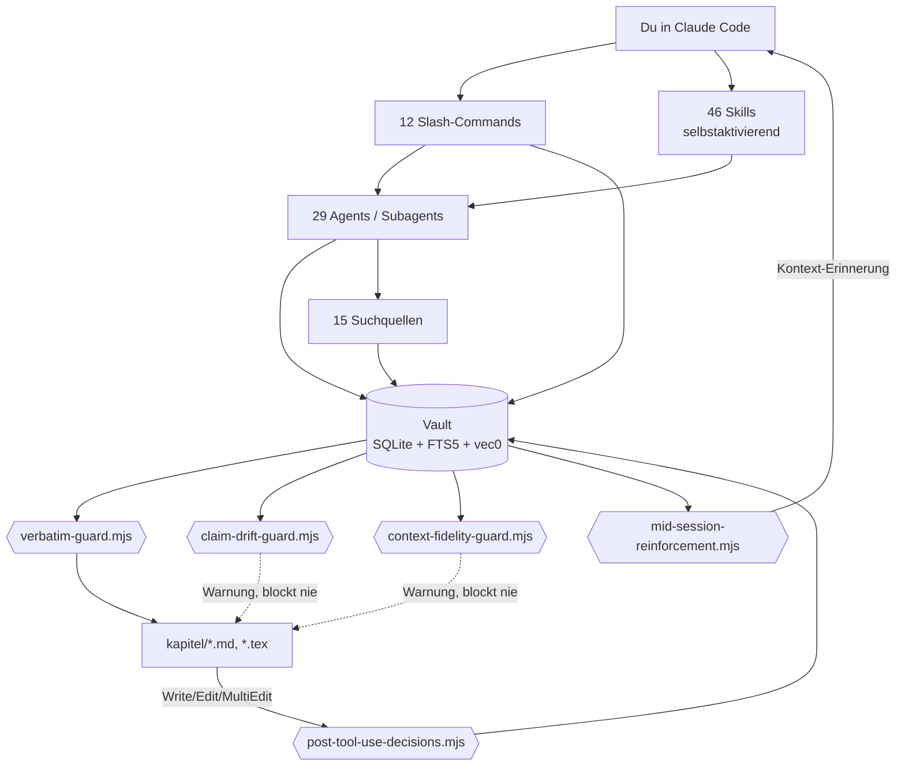

# Architektur — wie Vault, Hooks, Skills und Agents zusammenspielen

[← Doku-Übersicht](../README.md)

Das [Diagramm in der README](../../README.md#wie-es-aufgebaut-ist) zeigt die grobe Form in
sechs Knoten. Hier steht dieselbe Architektur eine Ebene tiefer: welche der acht
Hook-Skripte aus dem [Hooks-Stack](hooks.md) an welcher Stelle greifen, und wie ihre
Schreib- und Leserichtung zum Vault steht. Wer nur die Namen der Bausteine sucht, findet
sie in [Skills](skills.md), [Agents](agents.md) und [Vault-MCP-Server](vault.md) — dieses
Diagramm zeigt nur das Zusammenspiel, nicht jeden einzelnen Baustein.

## Das Bild

## Was die drei Guard-Hooks unterscheidet

Alle drei hängen am selben `PreToolUse`-Ereignis (`Write\|Edit\|MultiEdit` auf
Kapitel-/LaTeX-Dateien) und lesen denselben Vault, aber nur einer blockiert:

- **`verbatim-guard.mjs`** ist die harte Linie: ein Zitat, das nicht im Vault steht,
  verhindert den Write (Exit 2). Das ist der Guard, den der Quickstart in
  [`docs/quickstart-protocol.md`](../quickstart-protocol.md) vorführt.
- **`claim-drift-guard.mjs`** und **`context-fidelity-guard.mjs`** blockieren nie —
  sie warnen additiv (`systemMessage`), wenn eine Überarbeitung die Aussage um ein
  belegtes Zitat verschiebt beziehungsweise wenn der Originalkontext die Verwendung
  nicht mehr trägt. Details zu beiden stehen im [Hooks-Stack](hooks.md).

`post-tool-use-decisions.mjs` läuft danach auf `PostToolUse` und schreibt jede
Kapitel-Änderung als Decision zurück in den Vault — genau die Tabelle, die
`mid-session-reinforcement.mjs` in der nächsten Session wieder vorliest. Der Kreis
schließt sich beim Nutzer, nicht bei einer Datei.

## Was hier bewusst fehlt

`pre-compact.mjs`, `bypass-log-report.mjs` und `session-snapshot.mjs` laufen an
Session-Lifecycle-Events (`PreCompact`, `SessionStart`, `Stop`) und schreiben Snapshots
beziehungsweise Reports, ohne in den hier gezeigten Schreibpfad einzugreifen — sie stehen
vollständig im [Hooks-Stack](hooks.md), nicht in diesem Bild. Ebenfalls draußen: die
29 Agents und 46 Skills einzeln benannt, das Zusammenspiel der 15 Suchquellen im Detail
(siehe [Suchquellen, Scoring, Cluster](search.md)) und die MCP-Tool-Signaturen des Vaults
(siehe [Vault-MCP-Server](vault.md)) — ein Diagramm über alle Einzelteile ist unlesbar und
beim nächsten neuen Skill veraltet.
